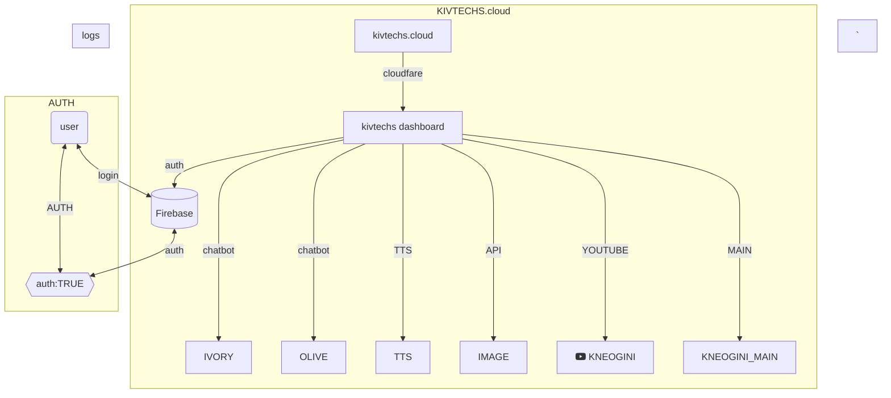

# kivtechs-uml

```mermaid
flowchart TD
    subgraph KIVTECHS.cloud
    A[kivtechs.cloud] -->|cloudfare| B(kivtechs dashboard)
    B[kivtechs dashboard] ----> |chatbot| C1[IVORY]
    B[kivtechs dashboard] ----> |chatbot| C2[OLIVE]
    B[kivtechs dashboard] ----> |TTS| H[TTS]
    B[kivtechs dashboard] ----> |API| E[IMAGE]
    B[kivtechs dashboard] ----> |YOUTUBE| I[fab:fa-youtube KNEOGINI]
    B[kivtechs dashboard] ----> |MAIN| G[KNEOGINI_MAIN]
    B --auth-->D[(Firebase)]
    end
    subgraph AUTH
      A1(user) <-- login --> D[(Firebase)] <-- auth --> U{{ auth:TRUE }}
     A1  <-- AUTH --> U
     end
subgraph logs
 D[(Firebase)]
end
`
  
    


```
