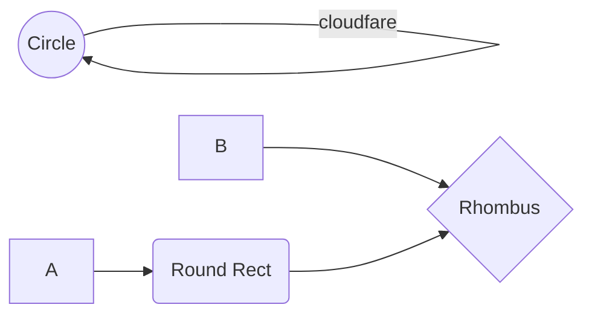

# kivtechs-uml

```mermaid
  graph TD;
      A-->B;
      A-->C;
      B-->D;
      C-->D;
```

```mermaid
graph LR
    KIVTECHS.cloud[Square Rect] -- cloudfare --> KIVTECHS.cloud((Circle))
    A --> C(Round Rect)
    B --> D{Rhombus}
    C --> D

```
