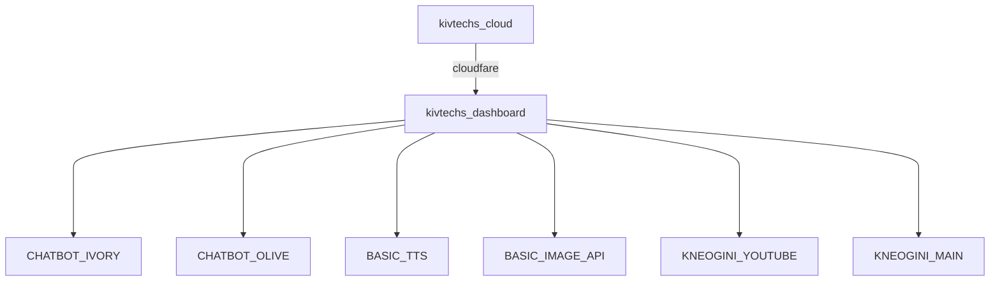

# kivtechs-uml

```mermaid
graph
    kivtechs_cloud -- cloudfare --> kivtechs_dashboard
    kivtechs_dashboard ----> CHATBOT_IVORY
    kivtechs_dashboard ----> CHATBOT_OLIVE
     kivtechs_dashboard ----> BASIC_TTS
     kivtechs_dashboard ----> BASIC_IMAGE_API
     kivtechs_dashboard ----> KNEOGINI_YOUTUBE
     kivtechs_dashboard ----> KNEOGINI_MAIN


```

```mermaid
flowchart TD
    A[kivtechs cloud] --> | cloudfare|  B(kivtechs dashboard)


```
