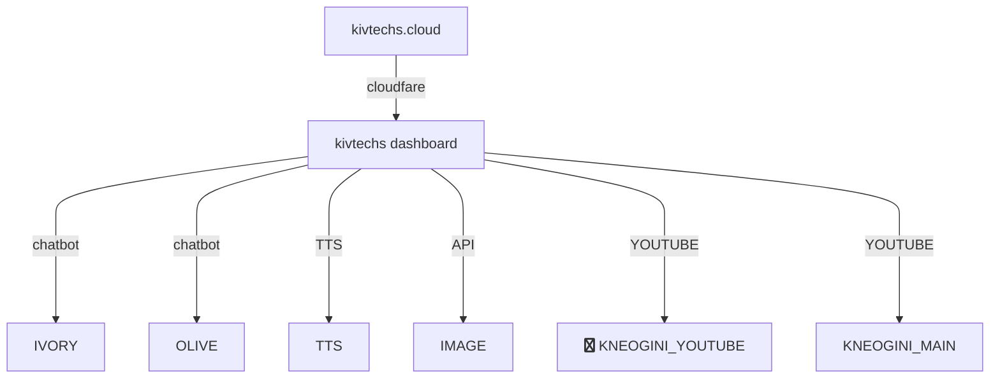

# kivtechs-uml

```mermaid
flowchart TD
    A[kivtechs.cloud] -->|cloudfare| B(kivtechs dashboard)
    B[kivtechs dashboard] ----> |chatbot| C1[IVORY]
    B[kivtechs dashboard] ----> |chatbot| C2[OLIVE]
    B[kivtechs dashboard] ----> |TTS| D[TTS]
    B[kivtechs dashboard] ----> |API| E[IMAGE]
 B[kivtechs dashboard] ----> |YOUTUBE| F[fa:fa-youtube KNEOGINI_YOUTUBE]
B[kivtechs dashboard] ----> |YOUTUBE| G[KNEOGINI_MAIN]


```
